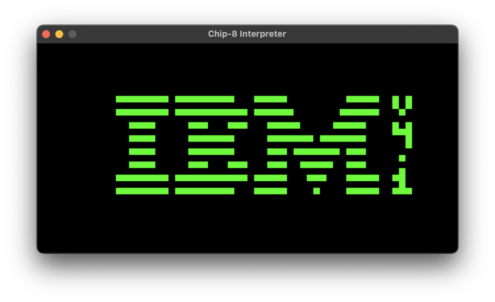

# Chip 8

## Current State

For now, original & schip-1.1 (partially for now) are supported. Support for Xo chip is planned. The emulator passes all the tests (other than the display wait quirk for the original spec) from [Timendus's suite](https://github.com/Timendus/chip8-test-suite).

## Usage

Run with the command `./GoCh8 --rom=path/to/rom`. You can also pass in an optional `--color` argument to set the color scheme. Black & white, green and yellow colors are supported. Default is black & white. Upon starting, the keyboard mapping will be printed to the console.

## Thanks to

- [Timendus's Chip 8 test suite](https://github.com/Timendus/chip8-test-suite)
- [Guide to making a CHIP-8 emulator](https://tobiasvl.github.io/blog/write-a-chip-8-emulator/)
- [CHIP-8 Variant Opcode Table](https://chip8.gulrak.net)
- The amazing people of EmuDev Discord.
